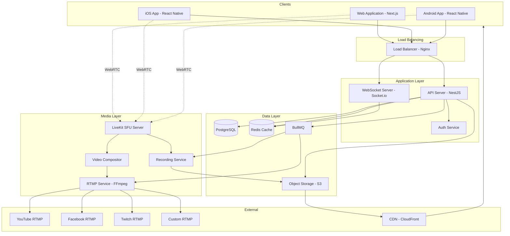

# StreamUs - Live Streaming Platform Architecture

## System Overview

StreamUs is a comprehensive live streaming platform that enables easy-to-use broadcasting with multistreaming, guest management, branding, audience engagement, and high-quality recording capabilities, optimized for both desktop and mobile devices.

## Technology Stack

### Frontend
- **Web Application**: Next.js 14+ with React 18+, TypeScript
- **Mobile Applications**: React Native with TypeScript
- **State Management**: Zustand or Redux Toolkit
- **UI Framework**: Tailwind CSS + Shadcn UI components
- **Video Rendering**: Canvas API + WebGL for overlays and compositions
- **Real-time**: Socket.io client for signaling and live updates

### Backend
- **API Server**: Node.js with NestJS framework
- **Media Server**: LiveKit SFU for WebRTC routing
- **Authentication**: JWT tokens with refresh token rotation
- **Database**: PostgreSQL for relational data, Redis for caching/sessions
- **Message Queue**: BullMQ with Redis for async processing
- **Real-time**: Socket.io server for signaling and live events
- **Object Storage**: AWS S3 or compatible (MinIO for self-hosting)

### Infrastructure
- **Deployment**: Docker + Docker Compose, Kubernetes-ready
- **CDN**: CloudFront or Cloudflare for asset delivery
- **Load Balancer**: Nginx or cloud-native LB
- **Monitoring**: Prometheus + Grafana
- **Logging**: Winston + ELK stack or cloud logging

### Media Processing
- **RTMP Ingestion/Output**: Node-Media-Server or FFmpeg
- **Recording**: FFmpeg for encoding and muxing
- **Transcoding**: FFmpeg with hardware acceleration
- **Video Composition**: FFmpeg filters + Canvas for overlays

## Architecture Diagram

## Core Features Implementation Strategy

### 1. Multi-Guest Video Conferencing (Up to 10 guests)
- **WebRTC Architecture**: Use LiveKit SFU for efficient media routing
- **Adaptive Bitrate**: Implement simulcast for different quality layers
- **Layout Engine**: Canvas-based compositor for arranging video feeds
- **Guest Management**: Real-time invite system via unique links

### 2. Multistreaming to Multiple Platforms
- **RTMP Output**: Parallel FFmpeg processes for each destination
- **Stream Health Monitoring**: Track bitrate, dropped frames, connection status
- **Automatic Reconnection**: Retry logic for failed streams
- **Platform APIs**: Integration with YouTube, Facebook, Twitch APIs for metadata

### 3. Branding and Overlays
- **Asset Management**: Upload logos, backgrounds, overlays to S3
- **Real-time Composition**: WebGL shaders for efficient overlay rendering
- **Scene Templates**: Pre-configured layouts (interview, presentation, etc.)
- **Brand Kit**: Save and reuse branding configurations

### 4. Audience Engagement (On-screen Comments)
- **Platform Integration**: WebSocket connections to social platform APIs
- **Comment Filtering**: Profanity filter and moderation tools
- **Display Queue**: Animated comment feed on stream overlay
- **Moderation Dashboard**: Host controls for comment approval

### 5. Pre-recorded Video Playback
- **Media Player Integration**: Video.js or custom WebRTC video injection
- **Sync Mechanism**: Timestamp-based sync with live stream
- **Playlist Management**: Queue multiple videos for playback
- **Transition Effects**: Smooth transitions between live and recorded

### 6. High-Quality Local Recording (4K Support)
- **Browser-based**: MediaRecorder API with high bitrate settings
- **Server-side**: FFmpeg recording from SFU media streams
- **Format Options**: MP4 (H.264/H.265), WebM (VP9)
- **Quality Tiers**: 
  - Free: 1080p30
  - Paid: 4K60 with higher bitrate

### 7. Professional Layouts
- **Grid Layouts**: Automatic arrangement for multiple guests
- **Picture-in-Picture**: Featured speaker with sidebar guests
- **Screen Sharing**: Full-screen share with optional picture-in-picture
- **Custom Positioning**: Drag-and-drop interface for manual positioning

### 8. Mobile Optimization (Low CPU Usage)
- **Hardware Encoding**: Use VideoToolbox (iOS) and MediaCodec (Android)
- **Adaptive Resolution**: Dynamic quality adjustment based on device capability
- **Battery Optimization**: Reduce framerate on battery power
- **Background Mode**: Audio-only streaming when app backgrounded
- **Efficient Capture**: Zero-copy camera pipeline

## Data Models

### Key Entities

**User**
- id, email, username, password_hash
- subscription_tier (free, pro, enterprise)
- created_at, updated_at

**Stream**
- id, user_id, title, description
- status (scheduled, live, ended)
- start_time, end_time
- settings (bitrate, resolution, layout)

**StreamDestination**
- id, stream_id, platform (youtube, facebook, twitch, custom)
- rtmp_url, stream_key (encrypted)
- status (connected, disconnected, error)

**Guest**
- id, stream_id, user_id (optional)
- join_token, display_name
- role (host, guest, moderator)
- audio_enabled, video_enabled

**Recording**
- id, stream_id
- file_url, file_size, duration
- resolution, format, bitrate

**BrandAsset**
- id, user_id, type (logo, background, overlay)
- file_url, file_name
- position, scale, opacity

## Security Considerations

1. **Authentication**: JWT with HTTP-only cookies and refresh tokens
2. **Authorization**: Role-based access control (RBAC) for stream management
3. **RTMP Keys**: Encrypted at rest, decrypted only during active streaming
4. **Guest Access**: Time-limited join tokens with expiration
5. **Rate Limiting**: Protect API endpoints from abuse
6. **Content Security**: CSP headers, HTTPS everywhere
7. **Media Encryption**: DTLS-SRTP for WebRTC traffic
8. **Input Validation**: Sanitize all user inputs to prevent injection

## Scalability Strategy

### Horizontal Scaling
- **API Servers**: Stateless, scale behind load balancer
- **LiveKit SFU**: Cluster mode with Redis for signaling
- **Worker Processes**: Scale recording/transcoding workers independently

### Vertical Scaling
- **Database**: Read replicas for analytics queries
- **Redis**: Separate instances for cache, sessions, queue
- **Media Servers**: GPU instances for hardware encoding

### Geographic Distribution
- **Multi-region CDN**: Serve static assets from edge locations
- **Regional SFU Nodes**: Route users to nearest media server
- **Database Replication**: Cross-region read replicas

## Performance Optimization

### Frontend
- Code splitting and lazy loading
- Service worker for offline capability
- WebAssembly for intensive computations (video processing)
- Virtual scrolling for large participant lists

### Backend
- Database query optimization and indexing
- Caching strategy (Redis) for frequently accessed data
- Connection pooling for database
- Efficient WebRTC signaling

### Media
- Simulcast for adaptive quality
- Dynamic bitrate adjustment (congestion control)
- Hardware-accelerated encoding/decoding
- Efficient codec selection (H.264 for compatibility, VP9/AV1 for quality)

## Monitoring and Observability

- **Application Metrics**: Request rate, latency, error rate
- **Media Metrics**: Bitrate, packet loss, jitter, round-trip time
- **Business Metrics**: Active streams, concurrent users, storage usage
- **Alerts**: PagerDuty/Slack integration for critical issues
- **Logging**: Structured logs with correlation IDs

## Development Phases

The implementation is organized into phases for systematic development. See the todo list for detailed tasks.
