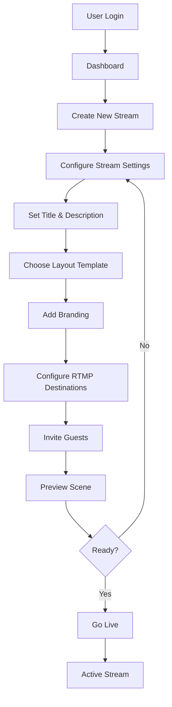
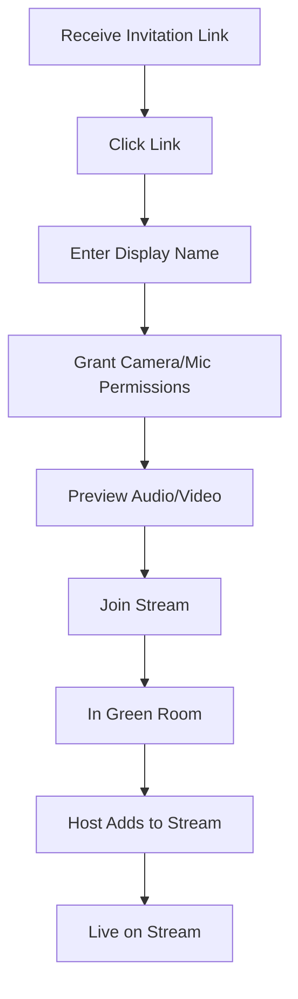
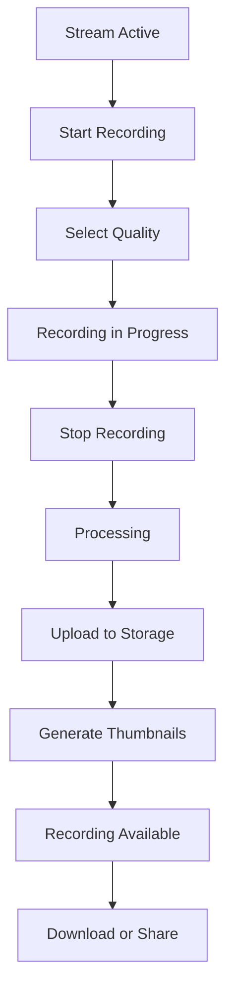

# StreamUs - Feature Specifications

## User Roles

### 1. Host (Stream Creator)
- Creates and manages streams
- Invites guests
- Controls stream settings (layout, branding, destinations)
- Manages audience comments
- Starts/stops recording and streaming

### 2. Guest (On-Screen Participant)
- Joins stream via invitation link
- Shares audio/video
- Can share screen (if permitted)
- Limited control interface

### 3. Viewer (Audience)
- Watches stream on external platforms (YouTube, Twitch, etc.)
- Posts comments that may appear on-screen
- No direct access to StreamUs interface

### 4. Admin (Platform Management)
- Manages users and subscriptions
- Monitors system health
- Reviews usage and analytics
- Handles support issues

## Core User Flows

### Stream Creation Flow

### Guest Join Flow

### Recording Flow

## Feature Specifications

### 1. Stream Setup and Management

**Stream Configuration**
- Title, description, category
- Thumbnail upload
- Scheduled start time (optional)
- Privacy settings (public, unlisted, private)
- Recording preferences (quality, format)
- Auto-save settings as templates

**Destination Management**
- Add multiple RTMP destinations
- Pre-configured platform integrations:
  - YouTube Live
  - Facebook Live
  - Twitch
  - Custom RTMP
- Store destination credentials securely
- Test connection before going live
- Enable/disable destinations per stream
- Platform-specific settings (title, description sync)

**Guest Management**
- Generate unique invitation links
- Set guest permissions:
  - Audio/video sharing
  - Screen sharing
  - Chat participation
- Time-limited access tokens
- Green room for pre-stream preparation
- Promote/demote guests to/from live view
- Mute/unmute guests
- Remove guests from stream

### 2. Video Layout and Composition

**Layout Templates**
1. **Grid**: Equal-sized tiles for all participants
   - 1x1 (single speaker)
   - 2x1 (side-by-side)
   - 2x2 (4 participants)
   - 3x3 (up to 9 participants)
   - 4x3 (up to 10 participants)

2. **Sidebar**: Featured speaker with sidebar participants
   - Main speaker (70% width) + sidebar (30% width)
   - Vertical or horizontal sidebar
   - Auto-switch speaker on audio activity

3. **Picture-in-Picture**: Full-screen content with floating participant
   - Useful for screen sharing
   - Position floating window (corners)
   - Resize floating window

4. **Fullscreen**: Single participant or content
   - Full 16:9 or custom aspect ratio
   - Useful for presentations or single speaker

5. **Custom**: Drag-and-drop positioning
   - Free-form placement
   - Individual resize per participant
   - Save custom layouts

**Layout Controls**
- Switch layouts during live stream
- Animate transitions (fade, slide, zoom)
- Auto-layout for joining/leaving guests
- Manual override for participant positioning
- Focus mode (highlight active speaker)

### 3. Branding and Overlays

**Brand Assets**
- Logo upload (PNG with transparency)
- Background images or colors
- Lower thirds (name/title graphics)
- Intro/outro videos
- Custom overlays (graphics, borders)

**Overlay Configuration**
- Position (corner, center, custom coordinates)
- Scale and opacity
- Animation (fade in/out, slide)
- Always-on or timed display
- Layer ordering (z-index)

**Brand Kits**
- Save brand configurations
- Quick-apply to new streams
- Share brand kits (for team accounts)
- Template marketplace (future feature)

**Scene Management**
- Create multiple scenes per stream
- Scene 1: Intro with branded background
- Scene 2: Interview layout with lower thirds
- Scene 3: Presentation with screen share
- Scene 4: Outro with branded background
- Hot-switch scenes during live stream
- Keyboard shortcuts for scene switching

### 4. Recording Features

**Recording Options**
- Local recording (browser-based)
  - Free tier: 1080p30, H.264, up to 2 hours
- Server-side recording
  - Pro tier: 4K60, H.265, unlimited duration
  - Enterprise tier: Multiple quality levels, raw feeds

**Recording Settings**
- Format: MP4, WebM
- Codec: H.264, H.265, VP9
- Bitrate: Variable based on quality
- Audio: AAC, Opus
- Separate audio tracks (future feature)

**Recording Management**
- List all recordings
- Preview with video player
- Download in selected format
- Share via link (expiring or permanent)
- Delete recordings
- Storage usage tracking
- Auto-archive old recordings

**Post-Recording Processing**
- Auto-generate thumbnails (multiple frames)
- Extract audio track
- Basic trimming (remove beginning/end)
- Add intro/outro (future feature)
- Export to social platforms (YouTube upload)

### 5. Multistreaming (RTMP Output)

**Platform Integrations**

**YouTube Live**
- OAuth authentication
- Fetch stream key automatically
- Sync title, description, category
- Set visibility (public, unlisted, private)
- Schedule streams
- Enable/disable DVR
- Monitor viewer count

**Facebook Live**
- OAuth authentication
- Select destination (profile, page, group)
- Sync title and description
- Set visibility (public, friends, custom)
- Monitor viewer count and engagement

**Twitch**
- OAuth authentication
- Fetch stream key
- Set title and category
- Monitor viewer count
- Integrate chat (for comment overlay)

**Custom RTMP**
- Manual RTMP URL input
- Stream key input (encrypted storage)
- Test connection
- No metadata sync
- Support for:
  - LinkedIn Live
  - Vimeo
  - Restream.io
  - Custom servers

**Stream Health Monitoring**
- Bitrate (current, target, actual)
- Dropped frames
- Network latency
- Connection status per destination
- Alert on connection issues
- Auto-reconnect on failure

**Bitrate Recommendations**
- 1080p60: 6-8 Mbps
- 1080p30: 4-5 Mbps
- 720p60: 4-5 Mbps
- 720p30: 2-3 Mbps
- Detect network capability and recommend

### 6. Audience Engagement (Comments)

**Comment Aggregation**
- Pull comments from:
  - YouTube Live Chat
  - Facebook Live Comments
  - Twitch Chat
  - Custom comment system (future feature)

**Comment Display**
- Animated overlay on stream
- Styles:
  - Scrolling ticker (bottom of screen)
  - Pop-up bubbles (fade in/out)
  - Side panel (pinned comments)
- Customization:
  - Font, size, color
  - Background color/opacity
  - Animation speed
  - Display duration

**Moderation**
- Auto-filter profanity
- Keyword filtering (block specific words)
- Approval queue (all comments require approval)
- Quick actions:
  - Approve (show on stream)
  - Reject (hide)
  - Ban user (block future comments)
- Pin important comments
- Priority queue (show pinned first)

**Moderator Role**
- Assign moderators to stream
- Moderator can approve/reject without host
- Audit log of moderation actions

### 7. Pre-recorded Content Playback

**Video Upload**
- Support formats: MP4, WebM, MOV, AVI
- Max file size: 5GB (free), 50GB (pro)
- Auto-transcode to compatible format
- Generate thumbnails

**Playlist Management**
- Create playlists of videos
- Reorder videos
- Set transition type (cut, fade, dissolve)
- Loop playlist (for intermission)

**Playback Control**
- Play/pause pre-recorded video
- Volume control (duck or mute during live)
- Sync with live stream composition
- Smooth transition camera → video → camera

**Use Cases**
- Intro video before stream starts
- Recorded segments within live show
- Intermission content during breaks
- Outro video at stream end
- Product demos or testimonials

**Advanced Playback**
- Schedule playback at specific time
- Auto-play on stream start
- Loop video until manually stopped
- Picture-in-picture (video + live camera)

### 8. Mobile Experience

**Mobile Web (Progressive Web App)**
- Responsive design for phones and tablets
- Install as app (iOS, Android)
- Full feature parity with desktop (where possible)
- Touch-optimized controls

**Native Mobile Apps (React Native)**

**iOS App**
- VideoToolbox hardware encoding
- AVFoundation camera access
- Background audio mode
- Picture-in-picture support
- Low Power Mode detection

**Android App**
- MediaCodec hardware encoding
- Camera2 API for camera access
- Background audio mode
- Battery optimization detection
- Support Android 8+

**Mobile-Specific Features**
- Portrait and landscape orientation
- Front/rear camera switching
- Simplified UI for smaller screens
- Voice commands (future feature)
- Mobile-optimized bandwidth usage

**Performance Optimizations**
- Adaptive resolution (480p → 1080p based on device)
- Reduced framerate on low battery
- Audio-only mode in background
- Zero-copy video pipeline
- Hardware encoding/decoding
- Connection quality indicator

### 9. User Dashboard

**Stream List**
- Upcoming scheduled streams
- Live streams (currently broadcasting)
- Past streams (with recordings)
- Drafts (saved but not streamed)

**Quick Actions**
- Create new stream
- Duplicate existing stream
- Edit stream settings
- Delete stream
- View analytics

**Analytics Overview**
- Total views (across all streams)
- Total watch time
- Average concurrent viewers
- Top performing streams
- Subscriber/follower growth

**Storage Usage**
- Recordings storage (GB used / total)
- Brand assets storage
- Usage by subscription tier
- Upgrade prompts for exceeded limits

### 10. Subscription Tiers

**Free Tier**
- 1 stream at a time
- Up to 3 guests
- 1080p30 streaming
- 1080p30 local recording (2 hours max)
- 2 RTMP destinations
- 5GB storage
- Basic branding (logo, background)
- Community support

**Pro Tier** ($29/month)
- 5 simultaneous streams
- Up to 10 guests per stream
- 4K60 streaming
- 4K60 server-side recording (unlimited)
- Unlimited RTMP destinations
- 100GB storage
- Advanced branding (overlays, scenes)
- Pre-recorded content playback
- Priority support

**Enterprise Tier** (Custom pricing)
- Unlimited streams
- Up to 50 guests per stream (custom SFU)
- Custom streaming resolutions
- Raw feed recording
- Unlimited storage
- White-label branding
- Dedicated account manager
- SLA guarantee
- Custom integrations

### 11. Settings and Preferences

**User Settings**
- Profile (name, email, avatar)
- Change password
- Two-factor authentication
- Notification preferences
- Language and timezone
- Theme (light, dark, auto)

**Stream Defaults**
- Default layout template
- Default branding
- Default RTMP destinations
- Default recording settings
- Auto-start recording
- Auto-save streams

**Privacy Settings**
- Public profile visibility
- Stream discoverability
- Data sharing preferences
- GDPR compliance (export, delete data)

**Billing Settings** (Pro/Enterprise)
- View current plan
- Payment method
- Billing history
- Usage reports
- Upgrade/downgrade plan
- Cancel subscription

### 12. Collaboration Features

**Team Accounts** (Enterprise)
- Multi-user access
- Role-based permissions:
  - Owner (full access)
  - Admin (manage streams, users)
  - Creator (create/edit streams)
  - Moderator (comment moderation only)
- Shared brand kits
- Shared recordings
- Activity log

**Guest Producers**
- Invite co-hosts to control stream
- Limited permissions (layout, mute, moderate)
- No access to account settings
- Temporary access (per stream)

## Non-Functional Requirements

### Performance
- Page load time < 2 seconds
- WebRTC connection setup < 3 seconds
- Stream latency < 5 seconds (to RTMP destinations)
- Support 10 simultaneous 1080p streams per user

### Scalability
- Support 10,000 concurrent users
- Support 1,000 simultaneous active streams (system-wide)
- Handle 100,000+ stored recordings
- Elastic scaling during peak usage

### Availability
- 99.9% uptime SLA (Enterprise tier)
- Graceful degradation on partial failures
- Auto-failover for critical services
- Regular backups (hourly incremental, daily full)

### Security
- HTTPS/TLS 1.3 everywhere
- DTLS-SRTP for WebRTC
- Encrypted RTMP keys at rest
- GDPR and CCPA compliance
- SOC 2 Type II (future)

### Accessibility
- WCAG 2.1 Level AA compliance
- Keyboard navigation support
- Screen reader compatibility
- High contrast mode
- Closed captions (future feature)

### Browser Support
- Chrome 100+
- Firefox 100+
- Safari 15+
- Edge 100+
- Mobile browsers (iOS Safari, Chrome Mobile)

### Mobile Support
- iOS 14+
- Android 8.0+
- Tablets optimized layout
- Responsive design for all screen sizes

## Future Features (Roadmap)

### Phase 2
- AI-powered scene recommendations
- Auto-editing highlights from recordings
- Real-time transcription and captions
- Multi-language support
- Virtual backgrounds
- Green screen support
- Advanced audio mixing

### Phase 3
- Podcast mode (audio-only streaming)
- Webinar features (Q&A, polls, hand raising)
- Virtual events platform
- Ticketed streams (monetization)
- Viewer analytics (heatmaps, engagement)
- Stream templates marketplace
- Integration with video editing tools

### Phase 4
- AI co-host/avatar
- 360° video support
- VR/AR integration
- Live shopping integration
- NFT ticketing
- Blockchain recording verification
