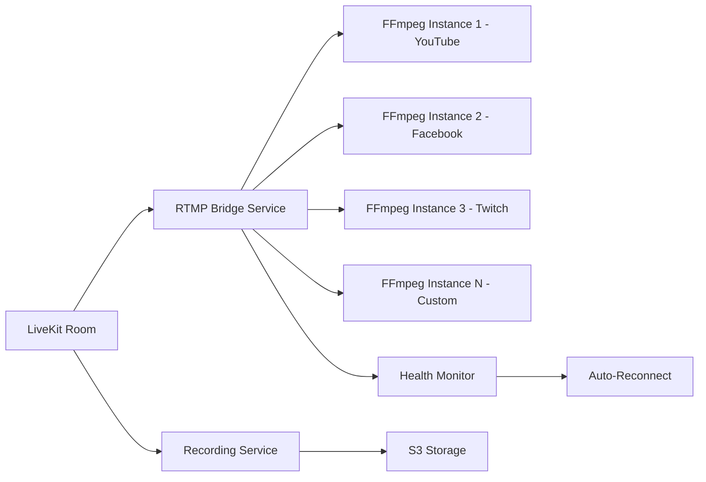

# StreamUs - Implementation Guide

## Project Overview

StreamUs is a StreamYard alternative built with a modern TypeScript stack, focusing on:
- **Easy-to-use interface** for non-technical users
- **Professional features** for content creators and businesses
- **High performance** with optimized mobile support
- **Scalability** for growth from 0 to 10,000+ users

## Key Technical Highlights

### WebRTC Architecture
- **LiveKit SFU** for efficient media routing (no server-side encoding/decoding)
- **Simulcast** for adaptive quality (high, medium, low bitrate layers)
- **Direct peer connections** between clients and SFU
- **Sub-3-second latency** for real-time interaction

### Video Composition Strategy
Two approaches for flexibility:

**1. Client-Side Composition (Default)**
```
User Camera → Canvas Compositor → MediaStream → WebRTC → LiveKit
                  ↓
            Overlays, Layouts, Branding
                  ↓
            Composed Output → RTMP Service
```

**Pros**: No server CPU load, instant layout changes, user sees exactly what's being streamed
**Cons**: Limited by client device performance

**2. Server-Side Composition (Pro Feature)**
```
Multiple WebRTC Streams → LiveKit → FFmpeg Compositor → RTMP Outputs
                                          ↓
                                    Recording Service
```

**Pros**: High-quality 4K output, consistent quality, better for recording
**Cons**: Higher server costs, additional latency

### Mobile Optimization Approach

**iOS (React Native + VideoToolbox)**
```typescript
// Use VideoToolbox for hardware H.264 encoding
import { VideoToolbox } from 'react-native-video-toolbox';

const captureConfig = {
  codec: 'h264',
  hardwareAcceleration: true,
  profile: 'baseline',
  resolution: adaptiveResolution(), // 480p to 1080p based on device
  framerate: batteryOptimizedFPS(), // 30fps on battery, 60fps on power
};
```

**Android (React Native + MediaCodec)**
```typescript
// Use MediaCodec for hardware encoding
import { MediaCodec } from 'react-native-media-codec';

const captureConfig = {
  codec: 'video/avc',
  hardwareAcceleration: true,
  colorFormat: MediaCodec.COLOR_FormatSurface, // Zero-copy pipeline
  resolution: adaptiveResolution(),
  framerate: batteryOptimizedFPS(),
};
```

### RTMP Multistreaming Architecture



**RTMP Bridge Implementation**:
- Pull composed stream from LiveKit via RTMP output or WebRTC
- Spawn separate FFmpeg process per destination
- Monitor health of each stream independently
- Auto-reconnect on failure with exponential backoff
- Parallel processing for zero overhead

### Database Schema (Simplified)

```sql
-- Users table
CREATE TABLE users (
  id UUID PRIMARY KEY DEFAULT gen_random_uuid(),
  email VARCHAR(255) UNIQUE NOT NULL,
  username VARCHAR(100) UNIQUE NOT NULL,
  password_hash VARCHAR(255) NOT NULL,
  subscription_tier VARCHAR(20) DEFAULT 'free',
  created_at TIMESTAMP DEFAULT NOW(),
  updated_at TIMESTAMP DEFAULT NOW()
);

-- Streams table
CREATE TABLE streams (
  id UUID PRIMARY KEY DEFAULT gen_random_uuid(),
  user_id UUID REFERENCES users(id) ON DELETE CASCADE,
  title VARCHAR(255) NOT NULL,
  description TEXT,
  status VARCHAR(20) DEFAULT 'draft', -- draft, scheduled, live, ended
  livekit_room_name VARCHAR(255),
  settings JSONB, -- layout, branding, recording preferences
  scheduled_start TIMESTAMP,
  actual_start TIMESTAMP,
  end_time TIMESTAMP,
  created_at TIMESTAMP DEFAULT NOW()
);

-- Stream destinations table
CREATE TABLE stream_destinations (
  id UUID PRIMARY KEY DEFAULT gen_random_uuid(),
  stream_id UUID REFERENCES streams(id) ON DELETE CASCADE,
  platform VARCHAR(50) NOT NULL, -- youtube, facebook, twitch, custom
  rtmp_url TEXT NOT NULL,
  stream_key TEXT NOT NULL, -- encrypted
  status VARCHAR(20) DEFAULT 'pending', -- pending, connected, disconnected, error
  metadata JSONB, -- platform-specific data
  created_at TIMESTAMP DEFAULT NOW()
);

-- Guests table
CREATE TABLE guests (
  id UUID PRIMARY KEY DEFAULT gen_random_uuid(),
  stream_id UUID REFERENCES streams(id) ON DELETE CASCADE,
  user_id UUID REFERENCES users(id), -- nullable for anonymous guests
  display_name VARCHAR(100) NOT NULL,
  join_token VARCHAR(255) UNIQUE NOT NULL,
  role VARCHAR(20) DEFAULT 'guest', -- host, guest, moderator
  permissions JSONB, -- audio, video, screen_share
  token_expires_at TIMESTAMP,
  joined_at TIMESTAMP,
  left_at TIMESTAMP,
  created_at TIMESTAMP DEFAULT NOW()
);

-- Recordings table
CREATE TABLE recordings (
  id UUID PRIMARY KEY DEFAULT gen_random_uuid(),
  stream_id UUID REFERENCES streams(id) ON DELETE CASCADE,
  file_url TEXT NOT NULL,
  thumbnail_url TEXT,
  file_size BIGINT, -- bytes
  duration INTEGER, -- seconds
  resolution VARCHAR(20), -- 1080p, 4K, etc.
  format VARCHAR(20), -- mp4, webm
  status VARCHAR(20) DEFAULT 'processing', -- processing, ready, error
  created_at TIMESTAMP DEFAULT NOW()
);

-- Brand assets table
CREATE TABLE brand_assets (
  id UUID PRIMARY KEY DEFAULT gen_random_uuid(),
  user_id UUID REFERENCES users(id) ON DELETE CASCADE,
  type VARCHAR(50) NOT NULL, -- logo, background, overlay, lower_third
  file_url TEXT NOT NULL,
  file_name VARCHAR(255),
  settings JSONB, -- position, scale, opacity, animation
  created_at TIMESTAMP DEFAULT NOW()
);

-- Indexes for performance
CREATE INDEX idx_streams_user_id ON streams(user_id);
CREATE INDEX idx_streams_status ON streams(status);
CREATE INDEX idx_destinations_stream_id ON stream_destinations(stream_id);
CREATE INDEX idx_guests_stream_id ON guests(stream_id);
CREATE INDEX idx_guests_token ON guests(join_token);
CREATE INDEX idx_recordings_stream_id ON recordings(stream_id);
CREATE INDEX idx_brand_assets_user_id ON brand_assets(user_id);
```

## Implementation Phases

### Phase 1: Foundation (Core Infrastructure)
**Goal**: Set up development environment and core services

**Deliverables**:
- Monorepo with backend, frontend, and shared packages
- Docker Compose for local development
- NestJS API with authentication
- Next.js frontend with basic UI
- PostgreSQL with initial schema
- Redis for caching
- LiveKit server running

**Success Criteria**:
- User can register, login, logout
- Authentication tokens work correctly
- Database migrations run successfully
- All services start with `docker-compose up`

### Phase 2: Basic Streaming (MVP)
**Goal**: Implement core streaming functionality

**Deliverables**:
- WebRTC room creation and joining
- Video grid layout (up to 4 participants)
- Basic audio/video controls (mute, camera off)
- Guest invitation via link
- Single RTMP output (YouTube or custom)
- Basic local recording

**Success Criteria**:
- Host can create a stream
- Guests can join via invitation link
- Video/audio works between participants
- Stream outputs to single RTMP destination
- Recording can be downloaded

### Phase 3: Advanced Layouts and Branding
**Goal**: Add professional visual features

**Deliverables**:
- Multiple layout templates
- Canvas-based video compositor
- Logo and background upload
- Overlay system
- Scene management
- Layout switching during live stream

**Success Criteria**:
- Users can switch between layout templates
- Logos and overlays render correctly on video
- Scenes can be created and switched live
- Branding persists across streams

### Phase 4: Multistreaming
**Goal**: Stream to multiple platforms simultaneously

**Deliverables**:
- YouTube Live API integration
- Facebook Live API integration
- Twitch API integration
- Custom RTMP destinations
- Stream health monitoring
- Auto-reconnection on failure

**Success Criteria**:
- Stream to 3+ destinations simultaneously
- Connection status visible in real-time
- Failed streams auto-reconnect
- Platform authentication (OAuth) works

### Phase 5: Audience Engagement
**Goal**: Display live comments on stream

**Deliverables**:
- YouTube chat integration
- Facebook comments integration
- Twitch chat integration
- Comment overlay on video
- Moderation dashboard
- Profanity filtering

**Success Criteria**:
- Comments from all platforms display on stream
- Host can approve/reject comments
- Overlay animation works smoothly
- Profanity filter blocks inappropriate content

### Phase 6: Advanced Recording and Playback
**Goal**: High-quality recording and pre-recorded content

**Deliverables**:
- Server-side 4K recording
- Multiple quality tiers
- Recording management interface
- Pre-recorded video upload
- Video playlist system
- Playback injection into stream

**Success Criteria**:
- 4K recording works on pro accounts
- Pre-recorded videos play within stream
- Smooth transitions between live and recorded
- Recordings auto-upload to S3

### Phase 7: Mobile Apps
**Goal**: Full-featured mobile streaming

**Deliverables**:
- React Native iOS app
- React Native Android app
- Hardware encoding integration
- Mobile-optimized UI
- Battery optimization
- Background audio mode

**Success Criteria**:
- Users can stream from mobile devices
- Video quality adapts to network
- App doesn't drain battery excessively
- Background audio works when app minimized

### Phase 8: Monetization and Scale
**Goal**: Subscription tiers and system scalability

**Deliverables**:
- Stripe payment integration
- Free, Pro, Enterprise tiers
- Usage tracking and limits
- Analytics dashboard
- Admin panel
- Kubernetes deployment manifests

**Success Criteria**:
- Users can subscribe and pay
- Features locked per tier
- System handles 1,000+ concurrent streams
- Analytics show accurate metrics

## Development Environment Setup

### Prerequisites
```bash
# Required software
- Node.js 20+
- pnpm 8+
- Docker Desktop
- Git
- FFmpeg (for local testing)

# Optional but recommended
- Postman or Insomnia (API testing)
- VS Code with extensions:
  - ESLint
  - Prettier
  - Docker
  - Prisma (if using Prisma ORM)
```

### Initial Setup Commands
```bash
# Clone repository (after initialization)
cd /Users/brandonsmith/Documents/StreamUs

# Install dependencies
pnpm install

# Copy environment variables
cp .env.example .env
# Edit .env with your configuration

# Start infrastructure services
docker-compose up -d postgres redis livekit

# Run database migrations
pnpm --filter backend migrate:dev

# Start development servers
pnpm dev
# This starts:
# - Backend API on http://localhost:3000
# - Frontend on http://localhost:3001
# - LiveKit on ws://localhost:7880
```

## Testing Strategy

### Unit Tests
- Backend services and controllers (Jest)
- Frontend components (Jest + React Testing Library)
- Shared utilities and types

### Integration Tests
- API endpoints with database
- WebRTC signaling flow
- RTMP connection setup
- File upload and storage

### End-to-End Tests
- Complete user flows (Playwright)
- Stream creation to going live
- Guest joining and interaction
- Recording and playback

### Performance Tests
- Load testing with 100+ concurrent streams
- WebRTC quality under various network conditions
- RTMP output stability over time
- Database query performance

### Testing Tools
- **Jest**: Unit and integration tests
- **Playwright**: E2E tests
- **k6** or **Artillery**: Load testing
- **WebRTC Test Suite**: Network simulation

## Deployment Strategy

### Development
- Local Docker Compose
- Hot-reload for fast iteration
- Mock external services

### Staging
- Single Kubernetes cluster or VPS
- PostgreSQL (managed or self-hosted)
- Redis cluster
- LiveKit server
- MinIO for storage
- Full feature parity with production
- Continuous deployment from `main` branch

### Production
- Multi-region deployment (US, EU, Asia)
- Managed PostgreSQL with replication
- Redis Cluster
- LiveKit cluster with load balancing
- AWS S3 + CloudFront CDN
- Kubernetes with auto-scaling
- Blue-green deployments
- Automated backups
- 99.9% uptime target

### Monitoring
- Application: Prometheus + Grafana
- Logs: ELK Stack or Loki
- Errors: Sentry
- Uptime: UptimeRobot or Pingdom
- User Analytics: PostHog or Mixpanel

## Cost Estimates (Production at Scale)

### Infrastructure Costs (Monthly)
- **Compute** (Kubernetes cluster): $500-2000
- **Database** (Managed PostgreSQL): $100-500
- **Redis** (Managed): $50-200
- **Storage** (S3): $50-500 (depends on recordings)
- **CDN** (CloudFront): $100-1000 (depends on traffic)
- **LiveKit** (Self-hosted): Included in compute
- **Total**: ~$1,000-4,000/month for 1,000-10,000 users

### Cost Optimization Strategies
- Use spot instances for worker nodes
- Lifecycle policies for old recordings (archive to Glacier)
- Optimize video encoding settings
- Cache frequently accessed content
- Regional deployment only where needed initially

## Security Checklist

- [ ] HTTPS/TLS everywhere
- [ ] JWT tokens with short expiration
- [ ] Refresh token rotation
- [ ] Password hashing with bcrypt
- [ ] CORS configuration
- [ ] Rate limiting on all endpoints
- [ ] Input validation and sanitization
- [ ] SQL injection prevention (parameterized queries)
- [ ] XSS prevention (CSP headers)
- [ ] CSRF protection
- [ ] Encrypted RTMP keys at rest
- [ ] Secure file upload validation
- [ ] Regular security audits
- [ ] Dependency vulnerability scanning
- [ ] GDPR compliance (data export/deletion)
- [ ] SOC 2 compliance (future)

## Performance Targets

### Frontend
- First Contentful Paint: < 1.5s
- Time to Interactive: < 3s
- Lighthouse Score: > 90

### Backend
- API Response Time: < 200ms (p95)
- WebSocket Connection: < 3s
- Database Queries: < 50ms (p95)

### Media
- WebRTC Connection Setup: < 3s
- Stream Latency: < 5s (to RTMP)
- Recording Quality: No dropped frames
- Support: 10 participants @ 1080p30 simultaneously

## Key Risks and Mitigations

### Risk 1: WebRTC Browser Compatibility
**Impact**: Users on older browsers can't stream
**Mitigation**: 
- Support Chrome 100+, Firefox 100+, Safari 15+
- Clear browser requirements on login
- Provide browser update prompts

### Risk 2: RTMP Connection Instability
**Impact**: Streams drop during live broadcast
**Mitigation**:
- Automatic reconnection with exponential backoff
- Connection health monitoring
- Alert host of connection issues
- Buffer management to handle brief outages

### Risk 3: Mobile Performance
**Impact**: Mobile devices overheat or battery drains
**Mitigation**:
- Hardware encoding on all supported devices
- Adaptive resolution based on device capability
- Battery monitoring and optimization
- Thermal throttling detection

### Risk 4: Storage Costs
**Impact**: High costs from storing many 4K recordings
**Mitigation**:
- Tiered storage limits per subscription
- Auto-delete old recordings (with user consent)
- Lifecycle policies to archive to cheaper storage
- Option for users to download and delete

### Risk 5: Scale Beyond Single LiveKit Server
**Impact**: Single SFU can't handle all streams
**Mitigation**:
- LiveKit cluster mode with Redis signaling
- Geographic load balancing (route to nearest)
- Horizontal scaling plan from day 1
- Monitor SFU load and add nodes proactively

## Success Metrics

### User Acquisition
- Monthly Active Users (MAU)
- Conversion rate (free → paid)
- Churn rate

### Engagement
- Streams created per user per month
- Average stream duration
- Guest participation rate
- Recording downloads

### Technical
- System uptime
- Average stream quality (bitrate, packet loss)
- Failed stream rate
- API error rate

### Business
- Monthly Recurring Revenue (MRR)
- Customer Lifetime Value (LTV)
- Cost per acquisition (CPA)
- Net Promoter Score (NPS)

## Next Steps

1. **Review this plan** - Discuss any questions or concerns
2. **Approve architecture** - Confirm technology choices work for your needs
3. **Prioritize features** - Adjust implementation phases if needed
4. **Switch to Code mode** - Begin implementation starting with Phase 1

The plan is comprehensive but flexible. We can adjust scope, technology choices, or implementation order based on your feedback.
