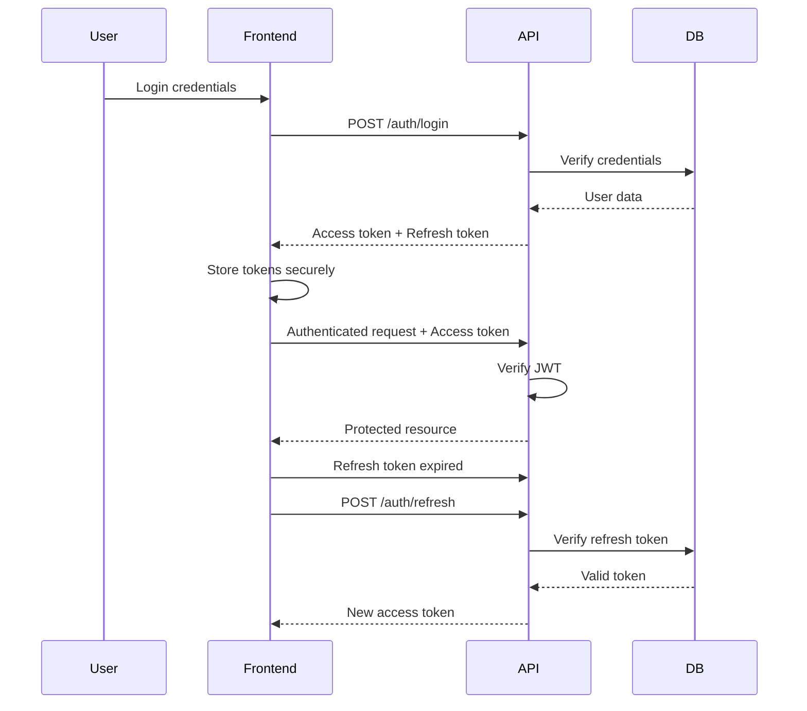
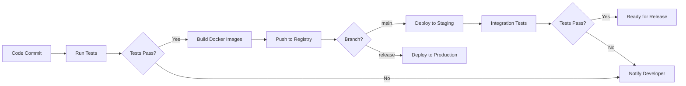

# Technical Decisions and Rationale

## Core Technology Choices

### 1. LiveKit SFU vs. Other Media Servers

**Decision**: Use LiveKit as the WebRTC SFU (Selective Forwarding Unit)

**Rationale**:
- **Scalability**: Proven to handle 100+ concurrent participants efficiently
- **Active Development**: Regular updates and strong community support (last update September 2024)
- **Platform SDKs**: Official SDKs for web, iOS, Android, React Native
- **Features**: Built-in simulcast, E2E encryption, cloud deployment support
- **Performance**: Lower latency than MCU-based solutions, less server CPU usage
- **Documentation**: Comprehensive docs and examples for production deployments

**Alternatives Considered**:
- **Janus**: More flexible but requires more custom configuration
- **Ant Media Server**: Good low-latency but commercial licensing for scale
- **Kurento**: Older, less active development
- **mediasoup**: Excellent performance but requires more low-level implementation

### 2. Monorepo with pnpm Workspaces

**Decision**: Use pnpm workspaces for monorepo management

**Rationale**:
- **Code Sharing**: Share TypeScript types, utilities, and configs across projects
- **Dependency Management**: pnpm's efficient storage (3x faster than npm)
- **Version Control**: Single repository for easier versioning and releases
- **Developer Experience**: Single `pnpm install` for all projects
- **Build Orchestration**: Unified build and test scripts

**Structure**:
```
/StreamUs
  /packages
    /backend          - NestJS API server
    /frontend-web     - Next.js web application
    /mobile           - React Native (iOS + Android)
    /shared           - Shared TypeScript types and utilities
  /infrastructure     - Docker, Kubernetes configs
  /docs              - Documentation
```

### 3. NestJS for Backend

**Decision**: Use NestJS framework for the API server

**Rationale**:
- **Architecture**: Built-in dependency injection and modular structure
- **TypeScript-first**: Strong typing across the entire backend
- **Scalability**: Microservices-ready architecture
- **WebSocket Support**: Native Socket.io integration for real-time features
- **Testing**: Built-in testing utilities with Jest
- **Community**: Large ecosystem with many pre-built modules
- **Documentation**: Excellent documentation and best practices

**Key Modules**:
- `@nestjs/platform-socket.io` - Real-time signaling
- `@nestjs/typeorm` or `@nestjs/prisma` - Database ORM
- `@nestjs/jwt` - Authentication
- `@nestjs/bull` - Job queue management
- `@nestjs/config` - Environment configuration

### 4. Next.js 14+ for Web Frontend

**Decision**: Use Next.js with App Router for the web application

**Rationale**:
- **React Server Components**: Better performance and SEO
- **Routing**: File-based routing with layouts
- **API Routes**: Built-in API endpoints for serverless functions
- **Optimization**: Automatic image optimization, code splitting
- **TypeScript**: First-class TypeScript support
- **Deployment**: Easy deployment to Vercel, AWS, or self-hosted
- **Streaming**: React 18 streaming SSR for faster page loads

**Key Libraries**:
- `@livekit/components-react` - Pre-built video components
- `socket.io-client` - Real-time communication
- `zustand` or `@reduxjs/toolkit` - State management
- `react-hook-form` + `zod` - Form validation
- `shadcn/ui` - Beautiful, accessible components

### 5. React Native for Mobile

**Decision**: Use React Native for cross-platform mobile development

**Rationale**:
- **Code Sharing**: Share 70-80% of code between iOS and Android
- **Developer Velocity**: Single codebase, faster iteration
- **LiveKit Support**: Official React Native SDK available
- **Native Modules**: Access to native hardware encoders
- **Community**: Mature ecosystem with many packages
- **Performance**: Good performance with proper optimization

**Native Modules Required**:
- `react-native-webrtc` - WebRTC support (included in LiveKit SDK)
- Hardware encoder bridges for VideoToolbox (iOS) and MediaCodec (Android)
- Background task handling for audio streaming
- Battery status monitoring for optimization

### 6. PostgreSQL for Primary Database

**Decision**: PostgreSQL as the primary relational database

**Rationale**:
- **Reliability**: ACID compliant, proven at scale
- **JSON Support**: Native JSONB for flexible schema sections
- **Performance**: Excellent query performance with proper indexing
- **Full-Text Search**: Built-in text search capabilities
- **Extensions**: PostGIS for geo queries, pg_trgm for fuzzy search
- **Replication**: Streaming replication for read scaling
- **Backup**: Point-in-time recovery (PITR) support

**Schema Approach**:
- Use TypeORM or Prisma for migrations
- Normalize core entities (users, streams, recordings)
- Use JSONB for flexible metadata and settings
- Proper indexing on foreign keys and frequently queried fields

### 7. Redis for Caching and Sessions

**Decision**: Redis for caching, sessions, and message queue

**Rationale**:
- **Performance**: In-memory data structure store, sub-millisecond latency
- **Versatility**: Cache, session store, pub/sub, queue
- **Persistence**: Optional RDB or AOF persistence
- **Scaling**: Redis Cluster for horizontal scaling
- **BullMQ Support**: Redis-backed job queue
- **WebSocket Adapter**: Socket.io Redis adapter for multi-server setup

**Use Cases**:
- Session storage (JWT refresh tokens)
- API response caching
- Rate limiting counters
- Real-time presence (online users)
- Job queue for async tasks (recording, transcoding)

### 8. FFmpeg for Media Processing

**Decision**: FFmpeg for video recording, transcoding, and RTMP streaming

**Rationale**:
- **Industry Standard**: Most mature and feature-rich media tool
- **Format Support**: Every codec and container format
- **Hardware Acceleration**: NVENC (NVIDIA), VideoToolbox (Apple), QSV (Intel)
- **RTMP**: Native RTMP input/output support
- **Filters**: Complex video filters for overlays and composition
- **Command-line**: Easy to spawn processes and monitor

**Key Operations**:
- **Recording**: Capture from LiveKit RTMP output or raw streams
- **Transcoding**: Convert recordings to desired formats and quality
- **RTMP Output**: Multistream to YouTube, Facebook, Twitch, custom destinations
- **Video Composition**: Overlay graphics, logos, lower thirds

**Hardware Acceleration**:
```bash
# NVIDIA GPU
ffmpeg -hwaccel cuda -i input.mp4 ...

# Intel Quick Sync
ffmpeg -hwaccel qsv -i input.mp4 ...

# Apple VideoToolbox (macOS)
ffmpeg -hwaccel videotoolbox -i input.mp4 ...
```

### 9. S3-Compatible Storage

**Decision**: AWS S3 (production) or MinIO (self-hosted) for object storage

**Rationale**:
- **Scalability**: Virtually unlimited storage
- **Durability**: 99.999999999% durability (AWS S3)
- **CDN Integration**: Easy CloudFront or Cloudflare integration
- **API**: Standard S3 API, easy SDK integration
- **Lifecycle Policies**: Automatic archiving or deletion
- **Multipart Upload**: Efficient large file uploads
- **MinIO Option**: Self-hosted S3-compatible for cost savings

**Storage Strategy**:
- **Bucket Structure**:
  - `brand-assets/` - User-uploaded logos, backgrounds, overlays
  - `recordings/` - Completed stream recordings
  - `temp/` - Temporary files (auto-cleanup after 24h)
  - `thumbnails/` - Auto-generated video thumbnails
  
### 10. Docker for Development and Deployment

**Decision**: Docker and Docker Compose for containerization

**Rationale**:
- **Consistency**: Same environment across dev, staging, production
- **Dependencies**: Package all dependencies in containers
- **Isolation**: Each service runs independently
- **Scaling**: Easy horizontal scaling with orchestration
- **Development**: Quick setup with docker-compose
- **Production**: Kubernetes-ready containers

**Container Strategy**:
- `backend` - NestJS API server
- `frontend` - Next.js web app (or static export + Nginx)
- `postgres` - PostgreSQL database
- `redis` - Redis cache and queue
- `livekit` - LiveKit SFU server
- `nginx` - Reverse proxy and load balancer

## Performance Optimization Strategies

### WebRTC Optimization

1. **Simulcast**: Send multiple quality layers (high, medium, low)
2. **SVC**: Scalable Video Coding for fine-grained quality adaptation
3. **Dynamic Bitrate**: Adjust based on network conditions (TWCC, REMB)
4. **Jitter Buffer**: Smooth packet arrival variations
5. **Packet Loss Recovery**: FEC (Forward Error Correction) and retransmissions

### Mobile Optimization

1. **Hardware Encoding**: VideoToolbox (iOS), MediaCodec (Android)
2. **Zero-Copy Pipeline**: Direct camera → encoder, avoid CPU copies
3. **Adaptive Resolution**: Start lower, increase if bandwidth allows
4. **Battery Optimization**: Reduce framerate/resolution on low battery
5. **Background Mode**: Audio-only when app backgrounded
6. **Network Detection**: WiFi vs. cellular quality adjustments

### Server Optimization

1. **Connection Pooling**: Reuse database connections
2. **Query Optimization**: Proper indexing, avoid N+1 queries
3. **Caching Strategy**: Redis for frequently accessed data
4. **CDN**: Serve static assets from edge locations
5. **Load Balancing**: Distribute requests across multiple servers
6. **Horizontal Scaling**: Add more servers as needed

### Recording Optimization

1. **Hardware Acceleration**: NVENC, QSV, VideoToolbox for encoding
2. **Chunked Recording**: Record in segments for reliability
3. **Background Processing**: Async jobs for transcoding
4. **Progressive Upload**: Stream upload to S3 during recording
5. **Quality Profiles**: Pre-defined encoding settings per tier

## Security Architecture

### Authentication Flow



### Security Measures

1. **Password Security**: bcrypt with cost factor 12
2. **JWT Tokens**: Short-lived access tokens (15min), longer refresh tokens (7d)
3. **Token Storage**: HTTP-only cookies for refresh tokens
4. **HTTPS Only**: TLS 1.3, enforce HTTPS redirects
5. **CORS**: Strict origin policies
6. **Rate Limiting**: Prevent brute force and DDoS
7. **Input Validation**: Sanitize all user inputs
8. **SQL Injection**: Use parameterized queries only
9. **XSS Prevention**: CSP headers, sanitize output
10. **RTMP Keys**: Encrypt at rest, decrypt only when needed

## Deployment Strategy

### Development Environment
- Docker Compose with hot-reload
- Local PostgreSQL, Redis, LiveKit
- Mock external services (payment, social APIs)

### Staging Environment
- Kubernetes cluster or cloud VMs
- Full production mirror
- Separate database and storage
- Testing with real APIs (sandbox mode)

### Production Environment
- Multi-region deployment for low latency
- Auto-scaling based on load
- Database replicas for read scaling
- CDN for global asset delivery
- Monitoring and alerting
- Automated backups and disaster recovery

### CI/CD Pipeline



## Cost Optimization

### Development Phase
- Use free tiers: PostgreSQL (local), Redis (local), LiveKit (self-hosted)
- MinIO for object storage instead of S3
- Single VPS for initial deployment

### Production Phase
- **Compute**: Right-size instances, use spot instances for workers
- **Storage**: S3 Intelligent-Tiering, lifecycle policies for old recordings
- **Bandwidth**: CDN to reduce origin traffic
- **Database**: Read replicas only when needed, connection pooling
- **Monitoring**: Open-source stack (Prometheus + Grafana) vs. paid services

### Scaling Strategy
1. **0-100 users**: Single server, shared resources
2. **100-1000 users**: Separate database, add Redis, CDN
3. **1000-10000 users**: Load balancer, multiple API servers, LiveKit cluster
4. **10000+ users**: Multi-region, database sharding, dedicated media servers

## Monitoring and Observability

### Key Metrics

**Application Metrics**:
- API request rate, latency, error rate
- WebSocket connections (active, new, closed)
- Job queue size and processing time
- Cache hit/miss ratio

**Media Metrics**:
- Active streams count
- WebRTC bitrate (sent/received)
- Packet loss percentage
- Round-trip time (RTT)
- RTMP connection status
- Recording failures

**Business Metrics**:
- Active users (DAU, MAU)
- Streams created per day
- Average stream duration
- Storage usage per user
- Revenue (subscriptions, usage)

**Infrastructure Metrics**:
- CPU, memory, disk usage
- Network throughput
- Database query performance
- Error logs and exceptions

### Alerting Rules
- API error rate > 5%
- WebRTC packet loss > 10%
- Database connection pool exhausted
- Disk usage > 85%
- RTMP stream failure
- Security events (failed logins, suspicious activity)
